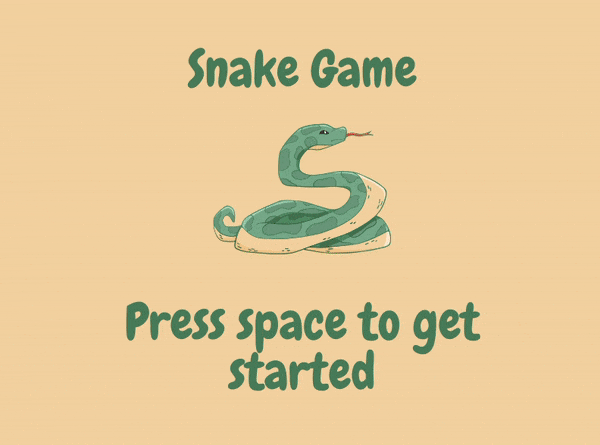

# Snake Game

Welcome to the Snake Game! This is a classic arcade game where you control a snake to eat food and grow longer while avoiding collisions with walls and yourself.

## Table of Contents

- [Preview](#preview)
- [Features](#features)
- [Graphics](#graphics)
- [Installation](#installation)
- [Usage](#usage)
- [Contributing](#contributing)
- [License](#license)
- [Contact](#contact)

## Preview



## Features

- Classic snake gameplay.
- Simple controls.
- Score tracking.
- Game over screen with final score display.
- Sound effects.

## Graphics

Graphics for this game are provided by Bas de Reuver. You can find more of Bas de Reuver's work at [bdrgames.nl](www.bdrgames.nl) or contact them at [bdr1976@gmail.com](mailto:bdr1976@gmail.com).

## Installation

1. Clone this repository to your local machine using:

    ```
    git clone https://github.com/ZainUlWahab/snake_game.git
    ```

2. Install the required dependencies:

    ```
    pip install pygame
    ```

## Usage

Run the game using:

```
python game.py
```

Use the arrow keys or WASD keys to control the snake. Eat the food to grow longer and try to achieve the highest score possible. But be careful not to collide with walls or yourself!

## Contributing

Contributions are welcome! If you'd like to contribute to this project, feel free to fork the repository and submit a pull request.

## License
Snake Game is released under the [MIT License](LICENSE).

## Contact
If you have any questions, or feedback, or just want to get in touch, feel free to reach out via email:

- **Email:** ulwahabzain@gmail.com
